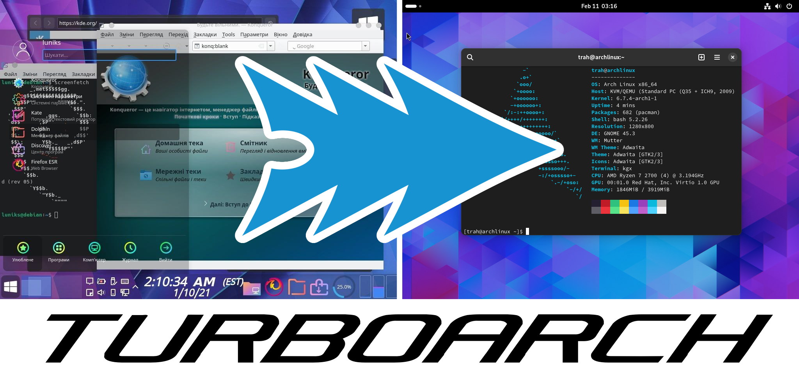

# TurboArch - Seamlessly Replace Your Current OS with Arch Linux NOW!
This script allows you to replace any Linux distribution with Arch Linux, preserving user data and some system configuration. 

[Video demonstration on YouTube](https://youtu.be/OCnaunwBoWw) 

## Quick start
Download and run required scripts:
```
git clone https://github.com/evgvs/turboarch
cd turboarch
sudo bash turboarch.sh
```
This will ask some questions and begin Arch Linux installation. Data in `/home`, disk configuration (even with LVM and LUKS!), user accounts and passwords, sudo/wheel group will be preserved. It is also possible to automatically install the best desktop environment (GNOME) into the new system.

> [!IMPORTANT]
> Everything in `/bin`, `/boot`, `/etc`, `/lib`, `/lib64`, `/sbin`, `/srv`, `/usr` and `/var` will be permanently removed. Other directories will not be affected at all, and no partitions will be formatted.

## Requirements
* Internet connection
* x86_64 Linux kernel version suitable for glibc in Arch Linux (3.2+ for glibc version 2.39)
* `grep`, `coreutils` and `util-linux`
* `bash` version 4+
* `wget` or `curl` and to download Arch Linux bootstrap, `tar` and `xz` to decompress bootstrap archive. You can also manually download and extract [bootstrap archive](https://geo.mirror.pkgbuild.com/iso/latest/) to `/archlinux-bootstrap`

## Installation process explained
### Stage 1 (turboarch.sh)
* The script copies needed files to safe place where they will not be removed
* Downloads Arch Linux rootfs and extract it to `/archlinux-bootstrap`
* Recursively mounts root to directory `host-system` inside `/archlinux-bootstrap` (`mount --rbind / /archlinux-bootstrap/host-system`)
* Mounts `/sys`, `/dev` and `/proc` to corresponding directories inside `/archlinux-bootstrap`
* Copies `stage2.sh` to `/archlinux-bootstrap`, chroots and runs the script
### Stage 2
* Removes everything in `/host-system/{bin, boot, etc, lib...}`
* Installs the base system with `pacstrap`
* Copies fstab and users configuration to new system
* Chroots to `/host-system` and runs `stage3.sh`
### Stage 3
* Configures locale, hostname and time
* Installs kernel and generate initramfs
* Installs and configures GRUB
* Installs GNOME and perform post-install configuration

## FAQ & Fine tuning

### Change mirrors
Edit the `mirrorlist.default` file to change the mirrors. If reflector is enabled, that mirrors will only be used to download python and reflector. 

### SSH
Installing via ssh seems like a bad idea. However, it will probably work. Script will detect `$SSH_CONNECTION` and proceed to installation. If you are running script from some another remote shell, set environment variable `FORCE_NO_OPENVT=1`.

### Preconfigure
To preconfigure the script, create a file called `config.default`:
```
GNOME=1
SET_SPACE_PASSWORD=1
SRAKUT=0
NETWORKMANAGER=1
LOCALTIME=Europe/Moscow
NEWHOSTNAME=archlinux
REFLECTOR=1
FORCE_REBOOT_AFTER_INSTALLATION=1
```
If `SET_SPACE_PASSWORD` is set to 1, root password will be ' ', i. e. space. Otherwise, script will try to copy user configuration from files `wheel_users`, `passwd_delta`, `shadow_delta`, `group_delta`, `gshadow_delta`. 

`wheel_users` contains list of users (one per line) that will be added to `wheel` group. This implies creation of `%wheel ALL=(ALL:ALL) ALL` rule in sudoers.

`passwd_delta`, `shadow_delta`, `group_delta`, `gshadow_delta` contains corresponding lines from getent. Example:
```
$ getent passwd pimp | tee -a passwd_delta
pimp:x:1000:1000::/home/pimp:/usr/bin/bash
$ getent shadow pimp | tee -a shadow_delta
pimp:$y$j9T$LuhFnrcezH0TUA1GaUqwa/$Ptme335MkS61UIlNQ.0jRD1doz7zQFzKIQcP6MXW6O1:19729:0:99999:7:::
```

### Tested distributions
Turboarch will work on almost any Linux system, because it has very few dependencies. It successfully replaced following distributions with Arch Linux:
* Manjaro
* Debian
* Ubuntu
* Fedora
* ROSA
* Astra
* Void
* Slackware
* Gentoo
* OpenSUSE
* Tiny Core

### I have /home, /var, /tmp, /lib, /usr/X11R6... on different partitions!
Turboarch basically just doesn't care about your partition scheme. All mountpoints will be transferred to the new system. 

### LVM & LUKS
It is supported, but if LVM or HRUKS is detected, turboarch will use SRACUT to generate initramfs. However, hooks for pacman will be installed, so SRACUT shouldn't be a big problem.

### ZFS
No, it is currently not supported.

### GRUB
On BIOS, GRUB will be installed to device that has partition that is mounted to `/boot` or `/`. On UEFI, GRUB will be installed to `/boot` or `/boot/efi`. OS-PROBER will be enabled by default.

### Why locale is set to en_US.UTF-8?
Because you should never use any language other than English in any interface on any of your devices.
